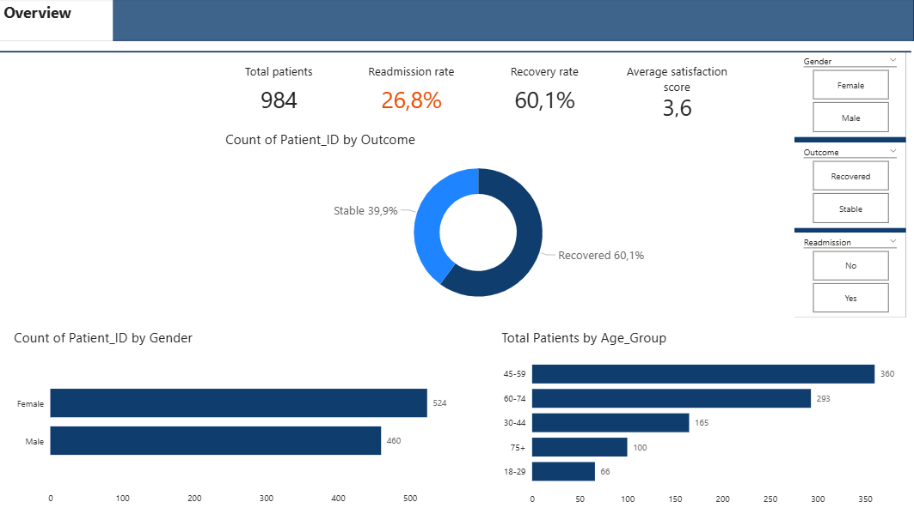
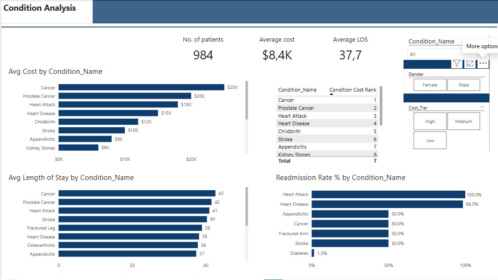
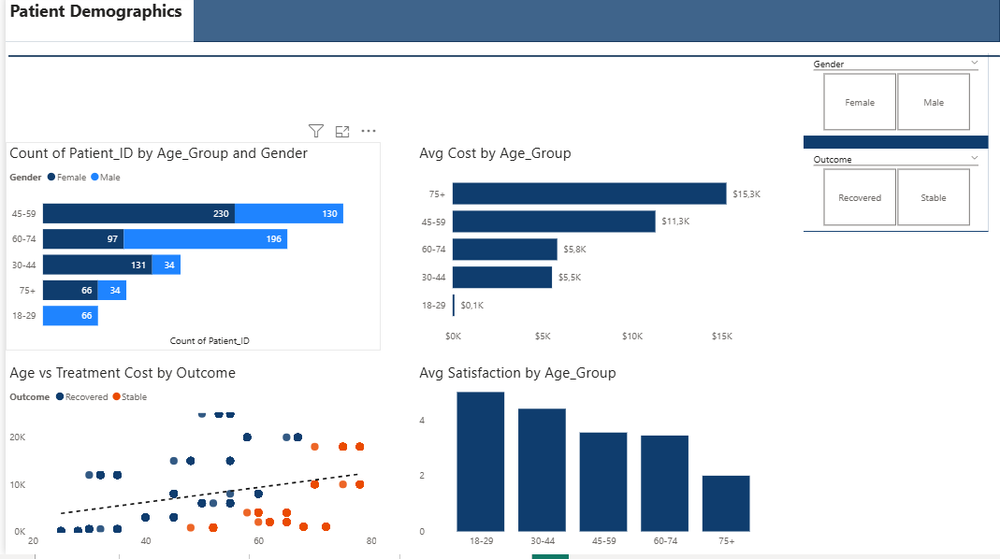
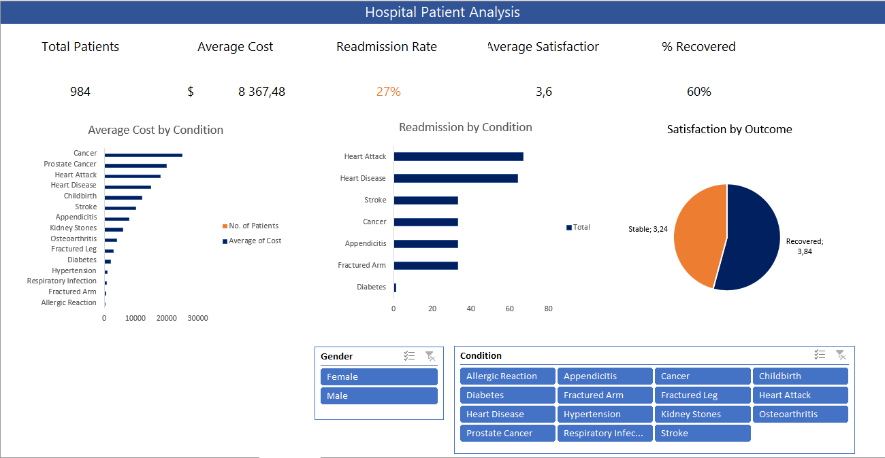

# 🏥 Hospital Patient Records — End-to-End Data Analytics Project


## 📌 Project Overview

This is a full end-to-end data analytics project analysing hospital patient records to uncover insights on treatment costs, readmission rates, patient outcomes, and satisfaction scores.

The project follows a real-world analytics workflow — from raw data and SQL querying, through Excel-based cleaning and analysis, to an interactive Power BI dashboard.

---

## 🗂️ Repository Structure

```
hospital-patient-records-analysis/
├── README.md
├── data/
│   └── hospital_data_analysis.csv
├── sql/
│   ├── hospital_schema.sql        
│   └── hospital_analysis.sql     
├── excel/
│   └── hospital_analysis.xlsx     
├── powerbi/
│   └── hospital_dashboard.pbix    
└── screenshots/
    ├── overview_page.png
    ├── condition_analysis.png
    ├── demographics_page.png
    └── excel_dashboard.png
```

---

## 🛠️ Tools & Technologies

| Tool | Version | Purpose |
|---|---|---|
| MySQL | 8.0+ | Database design, SQL querying, views, stored procedures |
| MySQL Workbench | 8.0+ | Query editor and schema visualisation |
| Microsoft Excel | 2016 | Data cleaning, formula analysis, pivot tables, dashboard |
| Power BI Desktop | Latest | Interactive dashboard, DAX measures, slicers |
| GitHub | — | Version control and portfolio publishing |

---

## 📊 Dataset

| Property | Detail |
|---|---|
| Rows | 984 patient records |
| Columns | 10 |
| Source | Synthetic hospital dataset |
| Missing values | None |
| Duplicate rows | None |

### Column Reference

| Column | Type | Description |
|---|---|---|
| `Patient_ID` | Integer | Unique patient identifier (1–984) |
| `Age` | Integer | Patient age in years (25–78) |
| `Gender` | Text | Male / Female |
| `Condition` | Text | Medical diagnosis (15 unique conditions) |
| `Procedure` | Text | Treatment applied (15 unique procedures) |
| `Cost` | Integer | Total treatment cost in USD ($100–$25,000) |
| `Length_of_Stay` | Integer | Days admitted to hospital (1–76) |
| `Readmission` | Text | Whether the patient was readmitted (Yes / No) |
| `Outcome` | Text | Treatment result (Recovered / Stable) |
| `Satisfaction` | Integer | Patient satisfaction score (2–5) |

---

## ❓ Business Questions

This project was designed to answer 7 core business questions:

1. Which medical conditions cost the most to treat on average?
2. What is the overall readmission rate, and which conditions drive it?
3. Does patient age group affect treatment cost and length of stay?
4. Is there a relationship between patient outcome and satisfaction score?
5. How do cost and length of stay vary by gender?
6. Which conditions result in the longest hospital stays?
7. What percentage of patients recovered versus remained stable?

---

## 🗄️ Phase 1 — MySQL

### What Was Done
- Designed and created the `hospital_db` database schema
- Imported all 984 rows from CSV using the Table Data Import Wizard
- Wrote 10 analytical SQL queries covering aggregations, filtering, grouping, and window functions
- Created a reusable `VIEW` (`vw_condition_summary`) summarising all conditions in one query
- Created a parameterised `STORED PROCEDURE` (`sp_condition_report`) for on-demand condition reporting

### SQL Files

**`hospital_schema.sql`** — run this first:
- `CREATE DATABASE` and `CREATE TABLE` with correct data types
- `LOAD DATA INFILE` import script
- `CREATE VIEW vw_condition_summary`
- `CREATE PROCEDURE sp_condition_report`

**`hospital_analysis.sql`** — run this second:
- Query 1: Dataset overview (COUNT, AVG summary stats)
- Query 2: Patient count and % by gender
- Query 3: Patients segmented by age group with avg cost and LOS
- Query 4: Average cost by condition with `RANK()` window function
- Query 5: Readmission rate % by condition using `CASE WHEN`
- Query 6: Average length of stay by condition with `RANK()`
- Query 7: Satisfaction score by outcome
- Query 8: Cost and LOS comparison by gender
- Query 9: Top 5 most expensive conditions (`LIMIT`)
- Query 10: Patient cost vs condition average using `AVG() OVER (PARTITION BY)`

### Sample Query — Readmission Rate by Condition
```sql
SELECT
    Condition_Name,
    COUNT(*)                                                   AS total_patients,
    SUM(CASE WHEN Readmission = 'Yes' THEN 1 ELSE 0 END)      AS readmitted,
    ROUND(
        SUM(CASE WHEN Readmission = 'Yes' THEN 1 ELSE 0 END)
        * 100.0 / COUNT(*), 1
    )                                                          AS readmission_rate_pct
FROM patients
GROUP BY Condition_Name
ORDER BY readmission_rate_pct DESC;
```

---

## 📗 Phase 2 — Excel

### What Was Done
- Imported raw CSV and validated data integrity (no nulls, no duplicates, correct value ranges)
- Added 3 derived columns using nested `IF` formulas:
  - `Age_Group` — segments patients into 5 age bands
  - `Cost_Tier` — classifies cost as Low / Medium / High
  - `High_Satisfaction` — flags patients who scored 4 or 5
- Built a `Summary_Metrics` sheet with KPI formulas: `COUNTIFS`, `AVERAGEIF`, `MAXIFS`, `XLOOKUP`
- Created 4 PivotTables: cost by condition, readmission analysis, satisfaction by outcome, demographics by age group
- Built 5 charts: bar (cost by condition), clustered bar (readmission), pie (outcome split), column (age group), scatter (age vs cost)
- Assembled a final `Dashboard` tab with KPI boxes and linked slicers for Gender and Condition

### Key Formulas Used

```excel
-- Overall readmission rate
=COUNTIF(patients[Readmission],"Yes") / COUNTA(patients[Patient_ID])

-- Avg satisfaction for recovered patients only
=AVERAGEIF(patients[Outcome],"Recovered",patients[Satisfaction])

-- Female patients who were readmitted
=COUNTIFS(patients[Gender],"Female",patients[Readmission],"Yes")

-- Most expensive case for a given condition
=MAXIFS(patients[Cost], patients[Condition_Name], "Cancer")
```

---

## 📊 Phase 3 — Power BI

### What Was Done
- Connected Power BI directly to the cleaned CSV
- Applied Power Query (M) transformations: renamed reserved-word columns, set data types, added `Age_Group` and `Cost_Tier` custom columns
- Created 14 DAX measures covering patient counts, rates, cost analysis, satisfaction, and ranking
- Built a 4-page interactive report with slicers synced across all pages
- Published to Power BI Service for a shareable live link

### DAX Measures

```dax
Readmission Rate % =
    DIVIDE([Total Readmissions], [Total Patients], 0)

Recovery Rate % =
    DIVIDE(
        CALCULATE(COUNTROWS(patients), patients[Outcome] = "Recovered"),
        [Total Patients], 0
    )

Avg Satisfaction (Recovered) =
    CALCULATE(AVERAGE(patients[Satisfaction]), patients[Outcome] = "Recovered")

Condition Cost Rank =
    RANKX(ALL(patients[Condition_Name]), CALCULATE(AVERAGE(patients[Cost])),, DESC, DENSE)
```

### Report Pages

| Page | Focus | Key Visuals |
|---|---|---|
| 1 — Overview | KPIs & summary | 4 cards, outcome donut, gender bar, age group bar |
| 2 — Condition Analysis | Cost, LOS, readmission by condition | 3 bar charts, ranked table |
| 3 — Demographics | Age and gender breakdown | Stacked bar, scatter plot, slicers |
| 4 — Cost & Satisfaction | Spend and experience | Cost tier bar, satisfaction by outcome, score distribution |

🔗 **[View Live Power BI Dashboard](#)** ← *(replace with your published link)*

---

## 💡 Key Findings

| # | Finding | Supporting Data |
|---|---|---|
| 1 | **Cancer is the most expensive condition** | Avg cost $25,000 — 250× more than Allergic Reaction ($100) |
| 2 | **Heart Attack has a 100% readmission rate** | Every Heart Attack patient in the dataset was readmitted |
| 3 | **Heart Disease follows at 98.5% readmission** | 64 of 65 Heart Disease patients were readmitted |
| 4 | **Recovered patients are significantly more satisfied** | Avg 3.84 vs 3.24 for Stable patients — a 0.6-point gap |
| 5 | **Cancer patients have the longest stays** | Avg 42.7 days vs overall average of 37.7 days |
| 6 | **The 45–59 age group is the largest segment** | 359 patients (36.5% of total) |
| 7 | **73.2% of patients achieved full recovery** | 720 recovered vs 264 remained stable |

---

## 🚀 How to Run This Project

### MySQL Setup
```bash
# 1. Open MySQL Workbench and connect to your local server
# 2. Run the schema file to create the database, table, view and procedure:
source sql/hospital_schema.sql

# 3. Import the CSV (or use Table Data Import Wizard in Workbench):
LOAD DATA INFILE '/path/to/data/hospital_data_analysis.csv'
INTO TABLE patients
FIELDS TERMINATED BY ','
ENCLOSED BY '"'
LINES TERMINATED BY '\n'
IGNORE 1 ROWS;

# 4. Run the analysis queries:
source sql/hospital_analysis.sql
```

### Excel
1. Open `excel/hospital_analysis.xlsx`
2. Navigate to the **Dashboard** tab for the summary view
3. Use the Gender and Condition slicers to filter all charts simultaneously

### Power BI
1. Open `powerbi/hospital_dashboard.pbix` in Power BI Desktop
2. If prompted, update the data source path to your local CSV location
3. Use the slicers on each page to filter by Gender, Outcome, Readmission, Condition, or Cost Tier

---

## 📁 Screenshots

## Screenshots

### Overview


### Condition Analysis



### Demographics


### Excel Dashboard


---

## 🔮 Potential Next Steps

- Add a date/admission column to enable time-series analysis and trend charts
- Build a cost prediction model using age, condition and procedure as features
- Incorporate real-world hospital data (e.g. CMS public datasets) for external benchmarking
- Add a what-if parameter in Power BI to model how reducing readmissions impacts total cost

---

## 👤 Author

**[Your Name]**
📧 [your.email@example.com]
🔗 [LinkedIn Profile URL]
💼 [Portfolio URL]

---

## 📄 License

This project uses a synthetic dataset for educational and portfolio purposes. No real patient data was used.
